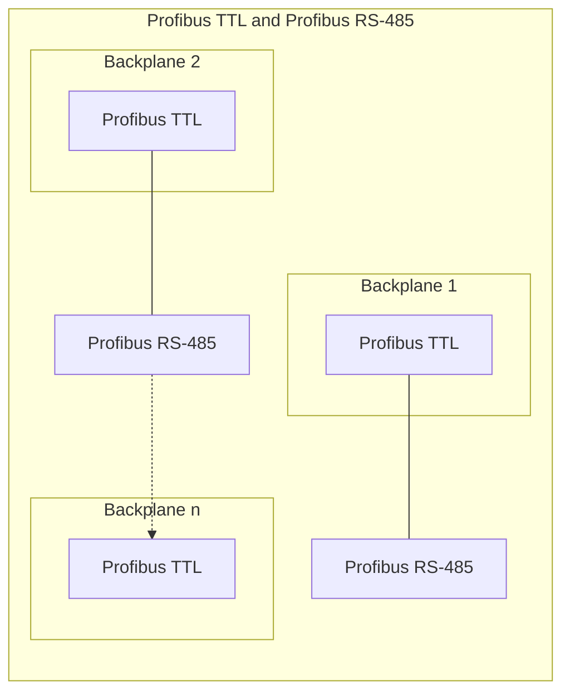
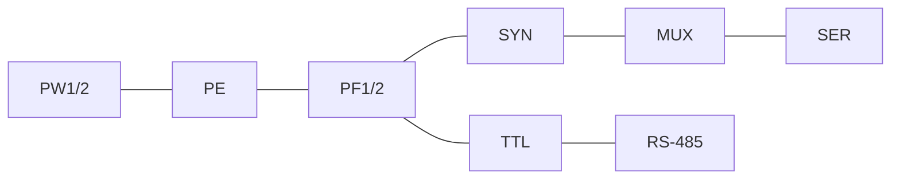
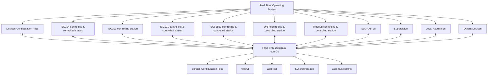
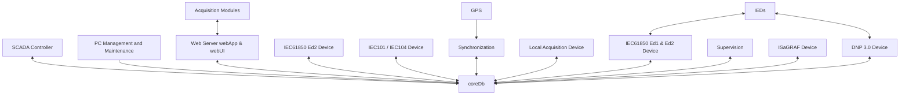
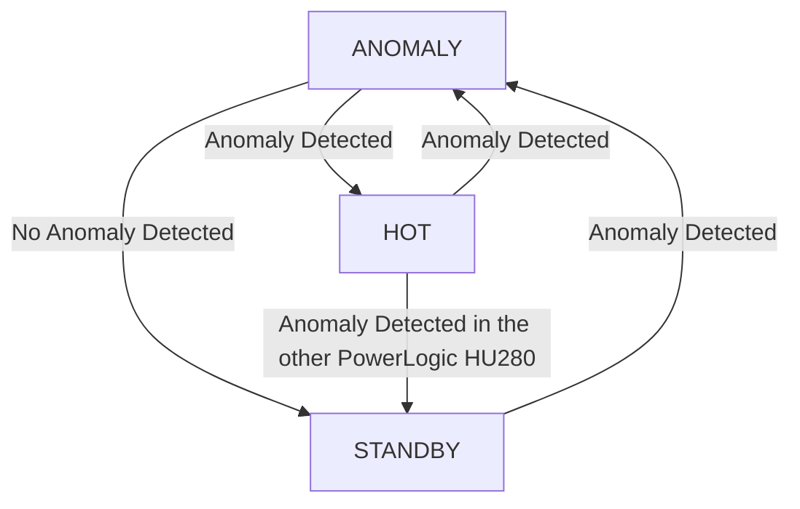
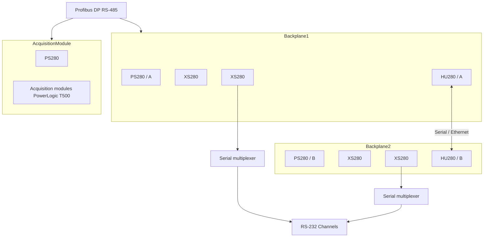
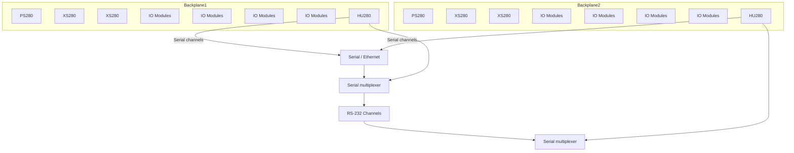
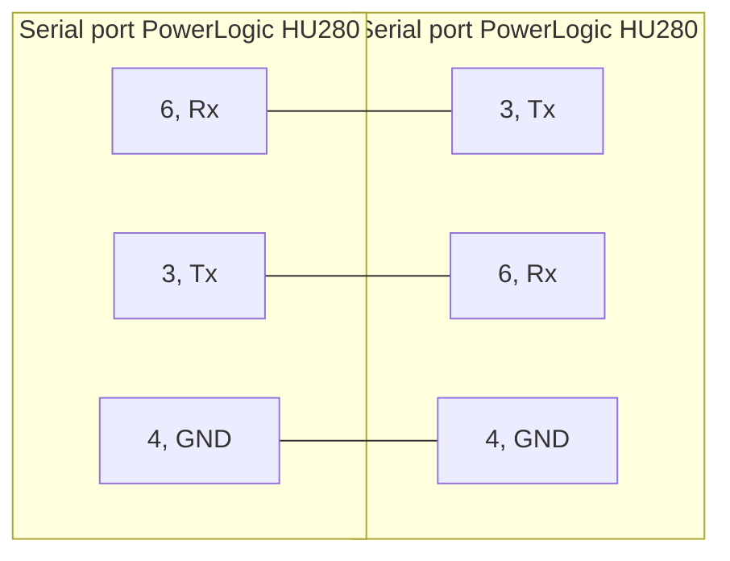

# PowerLogic T500 Substation Controller

# PowerLogic HU280

## User Manual

BQT7944901-01
07/2024

The image shows a Schneider Electric PowerLogic HU280 device. It appears to be a modular electronic device with a white casing and a green top section. The device has multiple connection ports visible on its front face. The Schneider Electric logo is visible on the green section.

www.se.com

Schneider Electric logo
---
# Legal Information

The information provided in this document contains general descriptions, technical characteristics and/or recommendations related to products/solutions.

This document is not intended as a substitute for a detailed study or operational and site-specific development or schematic plan. It is not to be used for determining suitability or reliability of the products/solutions for specific user applications. It is the duty of any such user to perform or have any professional expert of its choice (integrator, specifier or the like) perform the appropriate and comprehensive risk analysis, evaluation and testing of the products/solutions with respect to the relevant specific application or use thereof.

The Schneider Electric brand and any trademarks of Schneider Electric SE and its subsidiaries referred to in this document are the property of Schneider Electric SE or its subsidiaries. All other brands may be trademarks of their respective owner.

This document and its content are protected under applicable copyright laws and provided for informative use only. No part of this document may be reproduced or transmitted in any form or by any means (electronic, mechanical, photocopying, recording, or otherwise), for any purpose, without the prior written permission of Schneider Electric.

Schneider Electric does not grant any right or license for commercial use of the document or its content, except for a non-exclusive and personal license to consult it on an "as is" basis.

Schneider Electric reserves the right to make changes or updates with respect to or in the content of this document or the format thereof, at any time without notice.

To the extent permitted by applicable law, no responsibility or liability is assumed by Schneider Electric and its subsidiaries for any errors or omissions in the informational content of this document, as well as any non-intended use or misuse of the content thereof.
---
# Table of Contents

## Foreword
- Safety Information
- EU Directives
- UKCA Directives
- Cybersecurity
- Safety Instructions
- About the Book

## Product Description
- Introduction
- Available Module Types
- Internal Architecture using Backplane
- Baseline Software Platform
  - coreDb – Real-Time Database (RTDB)
  - Devices
  - Software Tools
- PowerLogic HU280 Module
  - PowerLogic HU280 Interfaces and Functions
  - Operation Control
  - PowerLogic HU280 Module Configuration
  - PowerLogic HU280 Module Synchronization
  - PowerLogic HU280 Module Communication
  - I/O Acquisition
  - Cybersecurity
- PowerLogic Ring

## Installation
- Handling Modules
- Location of Modules in the Backplane
- PowerLogic HU280 Module Location
- Power Supply and Grounding
- Assembling Modules
- PowerLogic HU280 Module Redundancy
  - Communication Channels
  - Switching Modes
- Redundancy Architectures
  - Two PowerLogic HU280 Modules in the Same Backplane
  - Two PowerLogic HU280 Modules in Different Backplanes
  - Dual System
- Wiring
  - Serial Communications
  - Ethernet Communication
  - IRIG-B Input and Watchdog Output

## Getting Started

## Software Upgrade

## Technical Specifications

## Glossary

BQT7944901-01
---
The image provided appears to be entirely blank or white. There is no visible content, text, diagrams, or any other discernible information on this page. Therefore, I cannot provide any markdown translation or description of content, as there is nothing to transcribe or describe.
---
# Foreword

## Safety Information

### Important Information

Read these instructions carefully, and look at the equipment to become familiar with the device before trying to install, operate, service, or maintain it. The following special messages may appear throughout this documentation or on the equipment to warn of potential hazards or to call attention to information that clarifies or simplifies a procedure.

The addition of this symbol to a "Danger" or "Warning" safety label indicates that an electrical hazard exists which will result in personal injury if the instructions are not followed.

This is the safety alert symbol. It is used to alert you to potential personal injury hazards. Obey all safety messages that follow this symbol to avoid possible injury or death.

| DANGER |
|--------|
| DANGER indicates a hazardous situation which, if not avoided, will result in death or serious injury. |

| WARNING |
|---------|
| WARNING indicates a hazardous situation which, if not avoided, could result in death or serious injury. |

| CAUTION |
|---------|
| CAUTION indicates a hazardous situation which, if not avoided, could result in minor or moderate injury. |

| NOTICE |
|--------|
| NOTICE is used to address practices not related to physical injury. |

## Please Note

Electrical equipment should be installed, operated, serviced, and maintained only by qualified personnel. No responsibility is assumed by Schneider Electric for any consequences arising out of the use of this material.

A qualified person is one who has skills and knowledge related to the construction and operation of electrical equipment and its installation, and has received safety training to recognize and avoid the hazards involved.
---
PowerLogic HU280                                                                                              Foreword

## EU Directives

This equipment complies with the following Directives of the European Parliament and of the Council:

- EMC Directive 2014/30/EU
- LVD Directive 2014/35/EU
- RoHS Directive 2015/863/EU

## UKCA Directives

UK Regulation:

- The Electromagnetic Compatibility Regulations SI 2016 No. 1091
- The Electrical Equipment (Safety) Regulations SI 2016 No. 1101
- The Restriction of the Use of Certain Hazardous Substances in Electrical and Electronic Equipment Regulations 2012 SI 2012 No. 3032

## Cybersecurity

Cyber threats are part of the digital world of communicating products. The PowerLogic™ HU280 module is concerned about possible cyber security issues and offers different features to users to manage the Cyber security and reduce the risks.

Knowledge is the first step to help prevent cyber intrusions. It is important to review the best practices to increase your cybersecurity awareness. Read the Recommended Cybersecurity Best Practices.

| WARNING |
|---------|
| HAZARD OF POTENTIAL COMPROMISE OF SYSTEM AVAILABILITY, INTEGRITY, SAFETY, AND CONFIDENTIALITY |
| • Change default passwords/passcodes to help prevent unauthorized access to device settings and information. Implement strong authentication controls, with high complexity passwords. |
| • Disable unused ports/services and default accounts where possible, to minimize pathways for malicious attacks. |
| • Place networked devices behind multiple layers of cyber defenses (such as firewall, network segmentation, and network intrusion detection and protection). |
| • Use cybersecurity best practices (for example: least privilege, separation of duties) to help prevent unauthorized exposure, loss, modification of data and logs, interruption of services, unintended operation, or potentially damaging the infrastructure or injuring operating people. |
| Failure to follow these instructions can result in death, serious injury, or equipment damage. |

6                                                                                                     BQT7944901-01
---
Foreword                                                                                                                  PowerLogic HU280

# Potential Risks and Compensating Controls

| NOTICE |
|---------|
| HAZARD OF UNAUTHORIZED ACCESS |
| Cyber threats are part of the digital world of communicating products. The T500 offers several different features to users to manage cyber security risks. Failure to follow these recommendations can increase the risk of unauthorized access. |
| Failure to follow these instructions can result in equipment damage. |

- Insecure protocols
  
  Modbus, DNP3, IEC 60870-5-101, IEC60870-5-104, IEC 61850 (IEC 61850 MMS (Manufacturing Message Specification) and IEC 61850 GOOSE (Generic Object Oriented System Event)) protocols, and some IT protocols (SNTP, DHCP, GPS) are insecure. If a malicious user gained access to your network, transmitted information could be disclosed or subject to tampering.
  
  This device provides TCP version for some protocols. On those protocols TLS usage is an option in the device configuration. List of protocols with the security capabilities mentioned above:
  - IEC 60870-5-104
  - DNP3
  - Modbus
  
  For transmitting data over an internal network, physically or logically segment the network and restrict access using standard controls such as firewalls and in particular IP Table allowlists.
  
  For transmitting data over an external network, encrypt protocol transmissions over all external connections using an encrypted tunnel, TLS wrapper or a similar solution.

- Enclosure
  
  The physical integrity of the installation must be ensured by the end user. Physical access to the PowerLogic HU280 module and the operational area must be restricted.

- Port hardening
  
  Schneider Electric recommends to carry out the following actions:
  - Firewall: use the IP allowlist to limit external accesses to known devices.
  - Port configuration: disable unused physical ports.

Refer to Port Hardening, page 21 for details.

The product is constantly evolving and encryption of relevant communication channels is planned in upcoming releases. Contact your SE branch office or field service representative for more information about cyber security features on the T500 platform.

BQT7944901-01                                                                                                                               7
---
PowerLogic HU280                                                                                                        Foreword

## Safety Instructions

```
DANGER
HAZARD OF ELECTRIC SHOCK, EXPLOSION, OR ARC FLASH
• Apply appropriate personal protective equipment (PPE) and follow safe
  electrical work practices. See NFPA 70E, NOM-029-STPS-2011, CSA Z462,
  NFC 18–510 and UTE C18–510–1.
• This unit must be installed and serviced only by qualified electrical
  personnel.
• Turn off all power supplies of this unit before working on or inside the unit.
• Always use a properly rated voltage sensing device to confirm that power is
  off.
• To open a live current transformer secondary circuit, turn off the primary side
  of the transformer and short-circuit the transformer secondary circuit.
• Set all devices, doors, and covers before turning on power to this unit.
Failure to follow these instructions will result in death or serious injury.
```

## About the Book

### Document Scope

This manual provides information for the assembly, wiring, configuration and
maintenance of the PowerLogic HU280 module (part number EMS72000).

### Document Revision History

| Document reference-revision | Release date | Modifications |
|---------------------------|--------------|---------------|
| BQT7944901-01 | 07/2024 | Addition of a safety message and information for Cybersecurity, page 6<br>Minor addition of information for Interfaces and Functions, page 18 |
| BQT7944901-00 | 04/2024 | Creation |

## Conformity

The PowerLogic HU280 module and all components have been developed in
accordance to the requirements for a quality management system, complying with
the ISO 9001:2015 Norm.

## T500 Range Products

| Configuration tool | Easergy Builder |
|--------------------|-----------------|
| Expansion modules | XS280 — T500 serial port expansion |
| I/O modules | AI160 — T500 16x analog input module<br>AX160 — T500 combined analog module (8 inputs + 4 ouputs) |

8                                                                                                               BQT7944901-01
---
Foreword                                                                                                                     PowerLogic HU280

| | DI180 — T500 32 x digital inputs |
| | DO180 — T500 16x relay outputs |
| | DO280 — T500 32x transistor outputs |
| Power supply modules | PS280 — T500 backplane power supply |
| Backplanes | BP260/N4 — T500 4 slot wall-mounted backplane |
| | BP260/N9 — T500 9 slot wall-mounted backplane |
| | BP270/N8 — T500 dual 4 slot rack-mounted backplane |
| | BP270/N9 — T500 9 slot rack-mounted backplane |

## Related Documents

| Product | Title of documentation | Reference number |
|---------|------------------------|-------------------|
| PowerLogic HU280 module | Installation Guide | PKR6248701 |
| PowerLogic HU280 module | EoLi Instructions | BQT7944902 |
| PowerLogic T500 Platform | User Manual | BQT7944801 |
| webApp Maintenance and Monitoring Tool | User Manual | BQT7944802 |
| PowerLogic T500 webUI | User Manual | BQT7944803 |
| Easergy Builder | User Manual | SE-S856-MSS |
| EcoStruxure™ Cybersecurity Admin Expert | User Manual | CAE/ENUM/B4.1 |
| AI160 module | User Manual | BQT7988301 |
| AX160 module | User Manual | BQT7988401 |
| XS280 module | User Manual | BQT7988501 |
| DI180 module | User Manual | BQT7945101 |
| DO180 module | User Manual | BQT7945201 |
| DO280 module | User Manual | BQT7945301 |

## UK Representative Address

Schneider Electric Limited
Stafford Park 5
Telford, TF3 3BL
United Kingdom
www.se.com

## Information on Non-Inclusive or Insensitive Terminology

As a responsible, inclusive company, Schneider Electric is constantly updating its
communications and products that contain non-inclusive or insensitive
terminology. However, despite these efforts, our content may still contain terms
that are deemed inappropriate by some customers.

BQT7944901-01                                                                                                                                  9
---
PowerLogic HU280                                                                                         Foreword

## Customer Care Center

For more information, you can download the app of the Customer Care Center by using the following QR code:

[QR code image]

10                                                                                                BQT7944901-01
---
# Product Description

## Introduction

The PowerLogic T500 range is a complete set of devices provided by Schneider Electric for real-time control applications and substation automation.

It meets the following requirements:

- Cost-efficiency, minimum downtime, and compliance with electrical safety, electromagnetic compatibility and environmental standards.
- Safety and reliability requirements for power, gas, water, residual water supply, etc.
- Centralized monitoring and control of geographically-distributed systems which support hierarchical data acquisition and redundant networks.
- Local monitoring and control with data sharing capabilities of plant-distributed devices.
- Quick troubleshooting by means of programmable automation execution.
- Modular design. All Input/Output, CPU, power supply and communication modules have an identical format, sharing the same enclosure.

## Available Module Types

The PowerLogic T500 range is a modular portfolio composed of following modules:

- The Head Unit: powerful CPU module (PowerLogic HU280) with large memory processing capabilities, fast-ethernet and fiber optic interfaces.
- The Serial Communication modules used to extend the communication capability of the CPU : XS280
- The Power Supply module, with the following options:
  - One or two PS280 modules
  - One or two external power supplies
- Input/Output modules used for analog and digital signals:
  - AI160
  - AX160
  - DI180
  - DO180
  - DO280
- Backplanes and chassis: frame used to support the other modules, by providing additional functions. Two backplane models are available:
  - BP260 backplane, with 4 and 9 slots
  - BP270 chassis, with 2x4 and 9 slots
- Terminal blocks for Input/Output modules

## Internal Architecture using Backplane

The communication with the input/ouput modules is established by the backplane. Each backplane includes a multifunctional bus (Profibus TTL) that provides the power and intercommunication requirements. This bus is designed to be tolerant to power and communication interruptions. Additionally, a Profibus RS-485 is included to support backplane expansion.
---
The figure below shows schematically the situation of both buses in the system:



These buses integrate the following bus lines:

* Profibus TTL:
    * PE - Protective earth ground
    * PW1/2 - Power bus (primary and redundant)
    * PF1/2 (TTL) - Primary and redundant Profibus TTL buses
    * MUX - Serial data bus for communication with the XS280 module
    * SYN (TTL) - Bus for synchronization of the modules (Pulse Per Second or PPS)
    * SER - Serial bus for synchronization between redundant CPU modules

* Profibus RS-485:
    * PF1/2 (485) - Primary and redundant Profibus RS-485 buses
    * SYN (485) - Bus RS-485 for synchronization of the modules (PPS)
---
Product Description                                                PowerLogic HU280

The figure below shows the buses available in the backplane:

Buses in a backplane

| Power | Communications |
|-------|----------------|
| PW 1/2 | PF 1/2 |
| PE | SYN |
|  | MUX |
|  | SER |



The diagram shows five modules connected to these buses:
- Three white modules (likely input/output modules)
- Two green Schneider Electric modules labeled as Profibus TTL and Profibus RS-485

The buses are represented as horizontal lines connecting the tops of these modules, with vertical lines dropping down to each module to show their connections to the various buses.

BQT7944901-01                                                                13
---
# Baseline Software Platform

The baseline software platform of Schneider Electric consists of:

- Real-time operating system (RTOS): LinuxRT
- Real-time applications and configuration files (XML format)
- Software tools: configuration, local and remote maintenance, supervision and monitoring

The following figure shows the various applications included in the software platform, as well as additional applications that implement new devices or protocols to upgrade the configuration tool.

## Baseline software platform



The operating system abstracts the hardware from the software applications and manages the applications in real-time. It integrates the basic protocols to access the PowerLogic HU280 module or the T500 substation controller and manages multiple users.

The core element is the real-time database coreDb, around which the other elements are developed.

# Main Elements of the Baseline Software Platform

The baseline software platform has the following main elements:

- coreDB - real-time DataBase (RTDB)
- Devices
- Software tools

# coreDb – Real-Time Database (RTDB)

The coreDb is the real-time database that stores the following information PowerLogic HU280:

- Information acquired from the devices
- Status of the PowerLogic HU280 and I/O modules

The coreDb also links the acquisition signals to the communication protocol signals. This database is generated in the PowerLogic HU280 by using the configuration information.

14                                                                                                                                   BQT7944901-01
---
Product Description                                                                                           PowerLogic HU280

The information from the devices is processed, stored in the real-time database, and then linked to the communication protocols signals of the PowerLogic HU280, whose function is to transfer the information to the primary device.

The coreDb can also receive information from a logic, which can be implemented by a third-party software such as ISaGRAF® or within the database itself with a formula type - internal device.

For more information about this functionality, refer to the Easergy Builder user manual, page 9.

### Relation between coreDb and other applications



The following concepts are related to coreDb:

- **Device Controller** (also referred to as controller): real-time application that accesses coreDb. Each controller acts as a producer and/or consumer of information managed by coreDb.

- **Point**: each register of coreDb is a point. A point can be included in the table Status, Analog, Command or Setpoint

  These internal tables present the following differences:
  
  - Depending on the point type: the status and command tables support integer values, whereas setpoint and analog tables manage floating values.
  
  - Depending on the treatment of the point: the status and analog points can be locked or reset to initial values, whereas the other two signal types cannot. All types of signal retain values in a non-volatile memory.

- **Device**: a set of I/O points that share a common source/destination. A typical example of a device is an IED that communicates with the PowerLogic HU280, or the representation of a SCADA exchanging information acquired or generated by the PowerLogic HU280. A device is always associated to a type of controller.

- **Source**: origin of the value of a coreDb data point.

  For Command and SetPoint tables, data points can have more than one source, in one or several devices.
  
  For Status and Analog tables, data point can only have one source.

- **Destination**: target of the value of a coreDb data point. You can configure coreDb data points to have several different destinations (in one or several devices).

- **Coordinate**: point identification within a device. It is unique for each point and has a different structure for each controller. It is described in detail in the appropriate manual of each controller.

BQT7944901-01                                                                                                                      15
---
PowerLogic HU280                                                                                      Product Description

- Configuration Plugin: specific configuration plugins extend the PowerLogic T500 configuration tool application to configure device controllers.

You can modify the configuration of each controller and device using the appropriate plugin. When the database is completely configured, the files with the new information can be generated and transferred to the PowerLogic HU280, where they are processed by the software on startup.

The coreDb database performs the real-time management of PowerLogic HU280 points. This real-time database is associated with data produced and consumed by the device controllers.

## Devices

Each type of device keeps a list of its associated points, identified by unique labels. These labels allow the identification of each device point unequivocally as the source or destination of a coreDb data point.

Each point is a piece of information produced (or consumed) by a device. Within a single device, the point identifiers (coordinates) are unique and cannot be used by two different points.

PowerLogic T500 configuration tool supports the following device configuration plugins:

- DNP 3.0 client and server
- Formula
- IEC101 client and server
- IEC104 client and server
- IEC103 client
- IEC61850 client Ed1
- IEC61850 Ed2 client and server
- ISAGRAF5
- local acquisition
- MODBUS client and server (with several profiles)
- SNMP
- SOE (Sequence of Events management)
- webUI

16                                                                                                        BQT7944901-01
---
Product Description                                                                                   PowerLogic HU280

## Software Tools

- **Easergy Builder**: engineering tool for the RTU OFFLINE configuration. It allows to include and adapt the different functions of the RTU to the system where it is integrated.

- **CAE**: engineering tool to define the security policy and assign roles to users. It allows the definition of a series of rights and responsibilities in the system for authorized users. It defines who, what, when and how to perform tasks according to the Role-Based Access Configurations (RBAC) model. It is a software tool that needs to be installed on a PC.

- **webApp**: web tool for online maintenance and monitoring of the RTU. Using the configuration defined in Easergy Builder and loaded in the RTU, you can refer and/or change some parameters through the web server. Unlike Easergy Builder, webApp does not allow adding new features. Only the parameters included in the configuration can be changed.

- **ESM**: EcoStruxure™ System Management tool that provides an Inventory Baseline Management (IBM) software, capable to perform maintenance on connected equipment, in an heterogeneous solution with a focus on cybersecurity:
  - Data Management: storage and backup while tracking the evolution of Firmware, Configuration, Setting Files and Documentation.
  - Manages firmware and configuration upload.
  - Monitors real-time changes firmware and configuration version for connected devices.
  - Cybersecurity: manages Role-Based Access Configurations for Schneider Electric devices.
  - Collects Syslogs from Schneider Electric connected devices.

- **webUI**: web-based graphical substation user interface. This tool can be used in two different environments:
  - webUI (run-time): web tool running in the RTU, used to monitor and control the information using screens previously designed by the user with the configuration tool.
  - webUI Add-on: edition tool included in Easergy Builder for creating and editing customized webUI screens. It is used to design new screens for the configuration loaded into the RTU or also modify the information displayed in those already available.

BQT7944901-01                                                                                                           17
---
# PowerLogic HU280 Module

## PowerLogic HU280 Interfaces and Functions

### PowerLogic HU280 Interfaces Description

The PowerLogic HU280 module includes a reset button located at the upper part to reinitialize the PowerLogic HU280 module.

A. Reset button with 3 functions:
   * Short press (1 s): reboots the device (software reset).
   * Medium press (3 s): factory reset. It restores the default values: users, network, and configuration. It requires confirmation (second press 0-3 s).
   * Long press (6 s): resets the hardware.

To understand the light signals while pressing the reset button, refer to PowerLogic Ring, page 22.

B. PowerLogic Ring providing indication of the PowerLogic HU280 state. Refer to PowerLogic Ring, page 22.

C. Watchdog output connector to indicate to external equipment that the PowerLogic HU280 is running correctly. Refer to Watchdog - WD Output, page 39.

D. IRIG-B connector used for synchronization. Refer to IRIG-B Input, page 39.

E. COM1 GPS 38,400 bauds RS-232/485 port with RJ45 connector. Refer to Serial Communication, page 35. COM1 has the possibility to be connected to GPS.

F. COM2 AUX 38,400 bauds RS-232/485 port with RJ45 connector. Refer to Serial Communication, page 35.

G. ETH MNT 10/100 Mbps port with RJ45 connector for maintenance purpose. Refer to Ethernet Communication - Station/General Ports, page 38.

H. WAN 1 and 2: 2 ports 10/100 Mbps port with RJ45 connectors to connect to SCADA/DCS or Cloud services. Refer to Ethernet Communication - Station/General Ports, page 38.

18 BQT7944901-01
---
Product Description                                                                                                    PowerLogic HU280

I. LAN 1, 2, 3 and 4: 4 x 100/1000 Mbps Ethernet ports with SFP connectors to
   connect to station bus devices. Refer to Ethernet Communication - Station/
   General Ports, page 38.
J. Screw to fasten the module to the backplane.

## Operation Control

The PowerLogic HU280 module controls its own operation, as well as the
redundant CPU (if any) and the connected I/O modules, through the backplane:

- Operation mode monitoring includes:
  - Hardware and software watchdog monitoring CPU and I/O state.
  - Diagnostic information about PowerLogic HU280 module status through
    LED indicators and log file.
- Interface with the operator through the webApp, WebUI and PowerLogic
  T500 configuration tool.
- Firmware upgrade via webApp and EcoStruxure System Management tool.

Refer to Software Upgrade, page 41.

## PowerLogic HU280 Module Configuration

The PowerLogic HU280 module maintains and manages the information of the
real-time database (coreDb). In this database, the I/O signals are related to the
communication protocols signals.

The configuration of the PowerLogic HU280 module is based on XML files that are
generated with the PowerLogic T500 configuration tool. These XML files are
generated on a PC and sent to PowerLogic HU280 module via webApp.

Refer to BQT7944802 webApp – Maintenance and Monitoring Tool User Manual.

## PowerLogic HU280 Module Synchronization

Two different synchronization sources can be used. In the case of two sources,
the priority level is defined with a primary and a secondary source. If both sources
are active, only the primary source synchronizes the system.

NOTE: If the primary source is available, it is used to synchronize the
PowerLogic HU280 module. Otherwise, the secondary source is used.

The available synchronization sources are the following:

- GPS: a GPS connected to COM1 serial port.
- SNTP: the synchronization module includes a SNTP client and server, which
  can be used to synchronize from a network SNTP clock or as a time
  reference for other modules.
- Protocol: most control protocols can be used as synchronization source of
  the system.
- PTP: as indicated in the IEEE-1588 standard, a PTP primary device can
  synchronize other PTP devices (secondary devices) through one or several
  Ethernet interfaces. PowerLogic HU280 module can operate as PTP server to
  synchronize other devices connected to the Station Bus.
- IRIG-B: you can configure the PowerLogic HU280 synchronization module as
  an IRIG-B server and/or client. The compatible formats are: IRIG-B002, IRIG-
  B003, IRIG-B006 and IRIG-B007.

If the synchronization source is not configured, the manual synchronization via
webApp is created by default.

BQT7944901-01                                                                                                                            19
---
# PowerLogic HU280 Module Communication

PowerLogic HU280 module supports the following communication protocols:

- IEC101 client and server
- IEC103 client
- IEC104 client and server
- DNP 3.0 client and server
- Modbus client and server
- IEC61850 client, Edition 1 and 2
- IEC61850 server, Edition 2

## I/O Acquisition

The PowerLogic HU280 module manages the information exchange with the I/O modules. This information is sent from the acquisition module to the PowerLogic HU280 module through the Profibus internal bus available in the backplane.

The software in the PowerLogic HU280 module has the following features:

- Access to the processing of I/O information, which offers added value to the information from field.
- Access to the internal bus to exchange information with the I/O modules.

## Cybersecurity

The PowerLogic HU280 module is supplied with a standard security policy, complemented with the definition of an RBAC model (Role-Based Access Control). This model is defined and managed through a special tool, CAE (EcoStruxure™ Cybersecurity Admin Expert).

## Access Control

Role Based Access Control (RBAC) is a tool used to define user access. RBAC is an alternative to traditional Mandatory Access Control (MAC) and Discretionary Access Control (DAC).

RBAC model manages access based on roles. A role is a collection of rights. A user has the rights defined by his/her role and rights inherited from the role hierarchy.

RBAC can be defined using one of the following possibilities:

- defined with the webApp and stored locally in PowerLogic HU280 module
- defined centrally through CAE tool, then transmitted and stored locally in PowerLogic HU280 module
  Refer to CAE/ENUM/B4.1 Cybersecurity Admin Expert User Manual for details.
- defined centrally on a central Radius/LDAP server

Authentication of any user trying to connect can be achieved in the following ways:

- based on local RBAC
- based on central RBAC through interrogation of Radius/LDAP Server then local RBAC
- based on local RBAC then central RBAC through interrogation of Radius/LDAP Server
---
Product Description                                                                                                            PowerLogic HU280

For more information about the security features in the HU280, contact Schneider Electric to access the HU280 Cybersecurity Guide, which requires the signing of a Non-Disclosure Agreement (NDA).

## Certificate Management

PowerLogic HU280 includes a physical Trusted Platform Module (TPM) device which is used to securely store private keys of certificates.

If a certificate is installed through webApp by SecurityAdmin user role, the private key of the certificate is securely saved in the TPM device. The certificate is used for Transport Layer Security (TLS).

The following PowerLogic HU280 protocols are over TLS:

- LDAP
- Syslog
- HTTPS
- CAE
- TCP channels for SCADA communications protocols (IEC104, DNP3) (configurable)

For more information about the security features in the HU280, contact Schneider Electric to access the HU280 Cybersecurity Guide, which requires the signing of a Non-Disclosure Agreement (NDA).

## Port Hardening

Device hardening is the process of configuring settings to strengthen security on devices. It involves password management, access control, disable unused physical ports, logical ports, protocols and services. Port hardening consists in hardening selectively each individual port, both physically and logically.

The following general rules apply:

- The logical (TCP/UDP) ports that are not used by the PowerLogic HU280 module are closed; there is no need to drop them explicitly.
- Some protocols and associated logical ports are activated per default (for example HTTPS). User can drop each port on each interface through Firewall drop port functionality in the configuration tool. To know the list of logical ports activated per default, refer to the HU280 Cybersecurity Guide, which requires the signing of a Non-Disclosure Agreement.

| Network - CPU A | Environment variables | Edit firewall rules |
|-----------------|------------------------|---------------------|
| Interfaces | Routers | Firewall |

| Device | WAN1 | □ Forwarding |
|--------|------|--------------|
| Rules |      |              |

| - WAN1 |
|--------|
| TCP 443 |
| - WAN2 |
| - LAN1 |
| - LAN2 |
| - LAN3 |
| - LAN4 |
| - ETH MNT |

| Type | Drop port ▼ |
|------|-------------|
| Drop port |
| Type | TCP ▼ | Port | 443 |

BQT7944901-01                                                                                                                                    21
---
PowerLogic HU280                                                                                                                       Product Description

- TCP/UDP SCADA protocol ports are closed by default, except if a called TCP communication channel has been created.
- When creating a communication channel, restrict the IP interface on which the channel will operate by selecting LocalPort and the associated IP address in the PowerLogic T500 configuration tool.

| Channel Setup |                |
|---------------|----------------|
| Channel       | Link           |
| Channel Name  | cscada1        |
| Description   |                |
| Type          | TCP            |
| Specific Parameters |          |
| TCP           |                |
| Mode          | CALLED         |
| Local Port    | 2404           |
| Use local IP  | ☐              |
| Remote Port   |                |
| Remote IP List |               |
|               | 10.1.1.50      |
| Connect timeout | 30000 ms     |
| Reconnect time | 15000 ms      |

## PowerLogic Ring

The PowerLogic ring provides information related to the product states.

| Ring color | Led | Ring behavior | Description of indications and actions |
|------------|-----|---------------|----------------------------------------|
| None       |     | Off           | Device unpowered.                      |
| Yellow     |     | Spinning      | Loading application and configuration. |
|            |     | Fixed         | Application loaded with invalid configuration. |
| Yellow and Green |  | Flashing   | HOT device with deteriorated communication links. |
| Green      |     | Flashing      | STANDBY device in REMOTE mode.         |
|            |     | Fixed         | HOT device in REMOTE mode.             |
| Blue       |     | Flashing      | STANDBY device in LOCAL mode.          |

22                                                                                                                                          BQT7944901-01
---
Product Description                                                                PowerLogic HU280

| Ring color | Led | Ring behavior | Description of indications and actions |
|------------|-----|---------------|----------------------------------------|
|            | Green LED | Fixed | HOT device in LOCAL mode. |
| Purple | Purple LED | Regressing countdown | Waiting for user confirmation of factory reset by pressing reset button again (0 – 3 s). |
|  | Purple LED | Slow flashing | Press the RESET button 1 s for software reset. |
|  | Purple LED | Fast flashing | Press the RESET button 3 s to initiate factory reset. |
| Red | Red LED | Fixed | Hardware or application non-operational. |
|  | Red LED | Fixed faded | Device powered, software not running. |

BQT7944901-01                                                                                        23
---
# Installation

## Handling Modules

Electrostatic discharges may damage semi-conductive devices within the module.

| NOTICE |
|---------|
| HAZARD OF ELECTROSTATIC DISCHARGE |
| • Handle the module from the front side, as far as possible from the backplane connectors. |
| • Do not touch the pins of the backplane connector. |
| • Keep the module in its antistatic bag or packaging box, when unused. |
| Failure to follow these instructions can result in equipment damage. |

## Location of Modules in the Backplane

All modules must be always installed in vertical position.

When using a power supply such as the PS280 module, it must be in slot 1 (left-hand side).

In power supply redundancy configurations, slot 1 and slot 2 must be reserved and available for the 2 power supply modules.

### Backplane positions

```
| SLOT 1 | SLOT 2 | SLOT 3 | SLOT 4 | SLOT 5 | SLOT 6 | SLOT 7 | SLOT 8 | SLOT 9 |
|--------|--------|--------|--------|--------|--------|--------|--------|--------|
|        |        |        |        |        |        |        |        |        |
|        |        |        |        |        |        |        |        |        |
|        |        |        |        |        |        |        |        |        |
```

## PowerLogic HU280 Module Location

| NOTICE |
|---------|
| HAZARD OF NOISE AND HEAT |
| The modules must be grouped to minimize the adverse effects caused by noise and heat. |
| Failure to follow these instructions can result in equipment damage. |

Insert the PowerLogic HU280 module as far as possible from the the PS280 modules.
---
Installation                                                                                                                                                                    PowerLogic HU280

Recommended position for PowerLogic HU280 module: slot 9 or slot 4 if a 4-slot
backplane is used. Slot 1 is the leftmost one.

[An image of a modular industrial control system is shown. It appears to be a PowerLogic HU280 system with multiple slots for modules. The system is predominantly white and gray, with a green module visible on the right side.]

If the system has PowerLogic HU280 module redundancy, both modules must be
put together in slots 8 and 9 of a 9-slot backplane, or in slots 3 and 4 in a 4-slot
backplane.

## Interconnection with Other Equipment

The HU280 incorporates Safety Extra Low Voltage (SELV) circuits across all its
communication ports. To sustain the performance in accordance with the
specifications outlined in the IEC 60255 standard (chapter 8.5), it is essential that
the ports of the external equipment to which they are connected to also adhere to
the SELV requirements.

BQT7944901-01                                                                                                                                                                                     25
---
PowerLogic HU280                                                                                                               Installation

## Power Supply and Grounding

| NOTICE |
|---------|
| HAZARD OF TERMINAL DAMAGE OR INCORRECT POWER SUPPLY |
| • Use appropriate tightening torques as indicated in the Installation Guide. |
| • Supply power to the PowerLogic HU280 module with one or two PS280 modules/external power supplies. |
| • When using an external power supply, the voltage input for the backplane is 5.4 Vdc. The external voltage input is not protected against overvoltage nor polarity inversion, so an incorrect wiring or an incorrect adjustment of the supply voltage could damage electronic parts. |
| Failure to follow these instructions can result in equipment damage. |

The PowerLogic HU280 module is powered up through the backplane, which can be powered by the PS280 module, by an external power supply or by a redundant power supply configuration.

The PowerLogic HU280 module is powered by the backplane and the backplane is powered by a power supply. There are several options:

- Option 1: one PS280 power supply module
- Option 2: one external power supply
- Option 3: two PS280 power supply modules
- Option 4: two external power supplies

### PS280 Power Supply

If a PS280 power supply is used, install it in position 1 (backplane slot 1 left-hand side).

The PS280 module is hot-swappable without altering the right behavior of the other devices in case a redundant PS280 module is connected.

In redundant power supply configurations, slot 1 and slot 2 are reserved for the two power supply modules.

### Auxiliary Power Supply

When using auxiliary power supplies, make sure that the power supply meets the power consumption of the installed modules. The external power supply must comply with reinforced insulation, overvoltage category III and pollution degree 2 for a rated voltage of 300 V, in accordance with the IEC 60255-27 standard.

### PowerLogic HU280 and Processing Requirements

The consumption of one PowerLogic HU280 module is maximum 15 W. Refer to the user manual of each installed module to check the specific consumption of your installation.

An internal supercapacitor is in charge of maintaining the RTC active. The minimum retention time is one week.

26                                                                                                                      BQT7944901-01
---
Installation                                                                                         PowerLogic HU280

## Grounding

The PowerLogic HU280 module is connected to the protective earth ground through the backplane or the chassis.

| NOTICE |
|---------|
| HAZARD OF IMPROPER INSTALLATION |
| • A dedicated connection between the backplane/chassis and protective earth ground must be installed. |
| • The section of the wire connection must be defined. The correct sizing must be aligned with the certification tests. |
| Failure to follow these instructions can result in equipment damage. |

## Assembling Modules

Modules can be installed in a 19-inches chassis (482 mm) (BP270) or a wall-mounted backplane (BP260).

To mount the module in the backplane, follow the instructions below:

1. Switch off the power supply. Switch off all power supplies in case of redundancy configuration.

2. Mount the module at the required position. If you are using a wall-mounted backplane, verify that the rear rails are properly mounted using the pre-drilled holes on the backplane.

3. Firmly press the module for a proper fit of the connector. Check that the module is correctly mounted to the backplane base.

4. Fix the module using the screw located at the top.

| CAUTION |
|---------|
| INADEQUATE EQUIPMENT OPERATION |
| • Ensure that the PowerLogic HU280 module is installed correctly. |
| • Check the ring color and behavior to check the module status. |
| Failure to follow these instructions can result in injury or equipment damage. |

BQT7944901-01                                                                                                          27
---
# PowerLogic HU280 Installation

The following image shows two modules inserted in a backplane. The module on the left is incorrectly installed. Correct the module installation before use even if the module appears to be functional.

## Incorrect installation of a module:

| Description |
|-------------|
| The image displays two electronic modules side by side. Both are rectangular, off-white devices with vented fronts. The module on the left has a red circle highlighting its base, indicating an incorrect installation. The base of this module is not fully seated or aligned with the backplane, protruding slightly. In contrast, the module on the right appears to be correctly installed, sitting flush with the mounting surface. Both modules have small displays or interfaces at the top. |

28 BQT7944901-01
---
# PowerLogic HU280 Module Redundancy

## PowerLogic HU280 Module Status

Together with the backplanes (BP260 and BP270), the PowerLogic HU280 module supports various redundancy architectures.

To control the various redundancy architectures, each PowerLogic HU280 in a redundant system can be in one of three different status:

- ANOMALY: the PowerLogic HU280 module needs to reboot.
  The user can define the ANOMALY condition with Formula or ISaGRAF to set the value of the supervision signal DOINGWELL.

- STANDBY: the PowerLogic HU280 module does not currently control the system, but is ready to take control.

- HOT: the PowerLogic HU280 module is actively controlling the system.

NOTE: Redundancy of PowerLogic HU280 module with SM_CPU866e from Saitel DP platform is not contemplated.

## Transition between HOT, STANDBY and ANOMALY Status

The transition between HOT, STANDBY and ANOMALY status is managed for each PowerLogic HU280 module of a redundant system as follows:



The PowerLogic HU280 module switches to the ANOMALY status when an anomaly is detected while being in HOT or STANDBY status. An anomaly can be caused by:

- an invalid configuration
- the supervision signal DOINGWELL set to 0

The user can customize the logic to set the DOINGWELL supervision signal to 0 with Formula or ISaGRAF. Refer to SE-S856–MSS Easergy Builder User Manual for more information.

Any transition to the ANOMALY status requires a reboot of the system.

Once the cause of the anomaly is removed or resolved, the PowerLogic HU280 module switches to the STANDBY status. It switches to the HOT status when the PowerLogic HU280 module that is currently in the HOT status detects an anomaly and switches to the ANOMALY status.

The various redundancy architectures are based on different factors:

- Physical location: both PowerLogic HU280 modules can be installed in the following ways:
  - both PowerLogic HU280 modules are installed one after the other in the same backplane.
  - the two PowerLogic HU280 modules are installed in different backplanes.
---
PowerLogic HU280                                                                                                 Installation

- Communication channels: PowerLogic HU280 manages the switching mechanism that can be configured to perform through various communication channels. Refer to Communication Channels, page 30.

- Switching mode: both COLD and HOT data switching modes are possible. In COLD switching data mode, the database of the STANDBY device is not updated with the HOT device database, but it only updates when the switching mechanism is triggered. In the HOT switching data mode, the STANDBY device is constantly updating its database with values from the HOT device.

The baseline software platform allows the configuration of multiple IP addresses associated with the HOT PowerLogic HU280 module. These IP addresses are dynamically assigned to allow PowerLogic HU280 modules in redundant systems to communicate with each other and use the same IP address after switching.

## Communication Channels

The switching mechanism is managed by the PowerLogic HU280 modules using the RCAP (Redundancy Control Asymmetric Protocol), which is a Schneider Electric proprietary protocol.

This protocol is used to manage the switching of the redundant PowerLogic HU280 modules using a communication channel that can also be redundant. The communication channels to manage the switching mechanism can be:

- Ethernet: the communication is established using an IP address through an Ethernet port.

- Serial: the PowerLogic HU280 modules communicate through one of the serial ports. Refer to Redundancy Wiring (Serial ports), page 37.

- Communication through the backplane: only available when the two PowerLogic HU280 modules are installed in the same backplane. The backplane includes a dedicated high speed serial channel so that the PowerLogic HU280 modules communicate.

## Switching Modes

Two switching modes are possible:

- COLD Data mode – Decoupled data: the database values and the supervision points are not synchronized in both PowerLogic HU280.

- HOT Data mode – Shared data: the STANDBY device is constantly updating its database with the values from the HOT device.

For both switching modes, the two PowerLogic HU280 modules should have the same configuration and the Environment Variable SLOT set to A and B respectively.

## COLD Data Mode

There is no data transfer between the two PowerLogic HU280 modules.

While being in STANDBY status, the PowerLogic HU280 does not update the database. Then, when it switches to HOT status, the PowerLogic HU280 initializes the database with default values.

This switching mode has the advantage to considerably improve availability so that maintenance, database modifications and test tasks can be performed on the STANDBY PowerLogic HU280, without disturbing the system performance.

30                                                                                                        BQT7944901-01
---
Installation                                                                                     PowerLogic HU280

## HOT Data Mode

Under HOT Data mode, a high-speed communication channel (Ethernet or through the backplane) is used between the two PowerLogic HU280 modules to synchronize the STANDBY database with the HOT database.

When switching is performed, the new HOT PowerLogic HU280 starts with the updated values.

The update is performed by exception, that is, only exchanging values of the points which have changed, except after a reset, when the entire database is updated.

The information shared by the two PowerLogic HU280 modules is exclusively related to the coreDb points.

The data, which is shared by the two PowerLogic HU280 modules, is exclusively related to coreDb points. Internal data about the device controllers is not shared, which can cause some information to be lost after a switchover. Examples of the data that is not shared are the commands sent by exception using protocols like IEC101 or IEC104. In the case of IEC 61850, if the option ActiveStandby is enabled, the HU280 continues operating with external devices, but the information is not updated in coreDb, so the STANDBY HU280 is not aware of that activity after a switchover.

ISaGRAF and the supervision device controllers are independently executed in both PowerLogic HU280 modules. Then, the points with sources in the supervision or ISaGRAF controllers are not shared between the two PowerLogic HU280 modules.

The PowerLogic HU280 modules can start the execution at different times. Consequently, the ISaGRAF sequential program can show different status in the PowerLogic HU280 modules. If the synchronization of the status between the two programs is required, implement the synchronization in the program with ISaGRAF variables that are mapped to the coreDb signals.

BQT7944901-01                                                                                                      31
---
# Redundancy Architectures

## Two PowerLogic HU280 Modules in the Same Backplane

Two PowerLogic HU280 modules in the same backplane is the simplest redundant configuration as it makes the best possible use of the features of the backplanes (BP260 and BP270). This configuration allows the two PowerLogic HU280 modules to share:

- the PowerLogic XS280 communication modules
- the acquisition modules

If two PowerLogic HU280 modules are installed in the same backplane, use the specific high-speed lines in the backplane or the dedicated communication links (Ethernet or serial) to set up the switching mechanism. This configuration allows the HOT and the COLD data switching modes. Refer to Switching Modes, page 30.

The disadvantage of this configuration is that an abnormal behavior detected in the backplane (such as an issue with the power supply) affects both PowerLogic HU280 modules that are located in the backplane.

### Example of two PowerLogic HU280 modules in the same backplane

```
| Profibus DP RS-485 | PS280 / A | PS280 / B | XS280 | XS280 | XS280 | XS280 | HU280 / A | HU280 / B |
|-------------------|-----------|-----------|-------|-------|-------|-------|-----------|-----------|
|                   | PowerLogic T500 | Acquisition modules PowerLogic T500 |           |           |
```
---
# Installation PowerLogic HU280

## Two PowerLogic HU280 Modules in Different Backplanes

An additional backplane is required for this configuration. The PowerLogic XS280 communication modules cannot communicate with the PowerLogic HU280 module if they are not on the same backplane. Therefore, the PowerLogic XS280 communication modules must also be duplicated in this configuration.

The two PowerLogic HU280 modules manage the switching mechanism that occurs between them, using a dedicated communication link (Ethernet or serial). This configuration allows the HOT and the COLD data switching modes. Refer to Switching Modes, page 30.

The advantage of this configuration is that an abnormal behavior detected in the backplane (such as an issue with the power supply) does not affect the entire system.

### Example of two PowerLogic HU280 modules in different backplanes



BQT7944901-01 33
---
# Dual System

The system duality is done to maximize the system availability. Duality means that all the system elements are duplicated. This is the typical configuration of data hubs and communication front-ends.

Two PowerLogic HU280 modules that are installed in different backplanes are associated with a specific number of communication and acquisition modules. This configuration allows the HOT and the COLD data switching modes. Refer to Switching Modes, page 30.

The communication channels could be multiplexed by using an external logic device.

## Example of two PowerLogic HU280 modules in a dual system


---
Installation                                                                                                  PowerLogic HU280

## Wiring

### Serial Communications

[An image of a Schneider Electric PowerLogic HU280 device is shown. It's a white rectangular device with a green top section. Two ports are labeled A and B on the device.]

A. COM1: RS-232/485 port for general purpose communications. This port can also be used to connect the GPS.

B. COM2: RS-232/485 port for general purpose communications. This port supports asynchronous communications.

Refer to RS-232/485 Communication Wiring, page 35.

The COM ports are functionally isolated up to level of 1 kVrms.

### RS-232/485 Communication Wiring

| NOTICE |
|--------|
| HAZARD OF INCORRECT WIRING |
| • Check that the cable connected to each COMx port is correct. |
| • Use identification tags on the cables to avoid mistakes. |
| Failure to follow these instructions can result in equipment damage. |

COM1 and COM2 ports are two isolated serial ports on the front side of the HU280; they are used for general purpose communications.

Connector type: standard RJ45

Supported maximal speed rate: 38400 bauds

BQT7944901-01                                                                                                                   35
---
PowerLogic HU280                                                                                                        Installation

## RS-232 Communication Port

COM 1 supports:
- Full modem control
- Asynchronous isolated communications

COM1 can receive a pulse per second signal (PPS) through pin 7, so it can be used as the GPS input, if required. The input PPS signal must be valid for RS-232 levels. The validated GPS devices to be connected to the COM1 port are GPS35 (Garmin) and GPS16 (Garmin).

Some GPS devices do not allow the use of the PPS signal. This operation mode implies that the synchronization accuracy is lower. It can produce a deviation of up to 10 ms in the generation of the signal.

NOTE: When using a GPS synchronization device, wire the PPS signal to achieve the highest accuracy in the synchronization.

| COM 1 | Description | I/O |
|-------|-------------|-----|
| 1 | CTS (Clear To Send) | Input |
| 2 | DTR (Data Terminal Ready) | Output |
| 3 | Tx (Data transmission) | Output |
| 4 | GND (Ground) | – |
| 5 | | – |
| 6 | Rx (Data Reception) | Input |
| 7 | DCD (Data Carrier Detect) or DSR (Data Set Ready) | Input |
| 8 | RTS (Request To Send) | Output |

COM 2 supports:
- partial modem control
- asynchronous isolated communications

| COM 2 | Description | I/O |
|-------|-------------|-----|
| 1 | CTS (Clear To Send) | Input |
| 2 | Not connected | – |
| 3 | Tx (Data transmission) | Output |
| 4 | GND (Ground) | – |
| 5 | | – |
| 6 | Rx (Data Reception) | Input |
| 7 | Not connected | – |
| 8 | RTS (Request To Send) | Output |

## RS-485 Communication Port

When COM1/COM2 are used as RS-485 communication port, the recommendations for the cables are the following:
- Resistance: < 100 Ω/km
- Section: 0.22 mm² (24 AWG)
- Characteristic impedance: 120 Ω
- Maximum length: 1,200 m
- Shielded twisted pair

36                                                                                                               BQT7944901-01
---
Installation                                                                                                   PowerLogic HU280

| COM 1 / COM 2 | Description |
|----------------|-------------|
| 1              | Not connected |
| 2              | Not connected |
| 3              | Y/A |
| 4              | GND (Ground) |
| 5              |  |
| 6              | Not connected |
| 7              | Not connected |
| 8              | Z/B |

NOTE: Note that A and B naming convention depends on the manufacturer. Check the naming convention of the connected product manufacturer.

## Redundancy Wiring (Serial ports)

In redundant systems, you can interconnect both PowerLogic HU280 modules using serial ports with the following pinout:

Cable description for redundancy



BQT7944901-01                                                                                                                      37
---
PowerLogic HU280                                                                                                        Installation

## Ethernet Communication

[An image of a Schneider Electric PowerLogic HU280 device is shown. It's a white rectangular device with a green top section. Various ports are labeled A, B, and C on the device.]

A. ETH MNT 10/100 Mbps port with RJ45 connector for maintenance purpose:
   - Software upgrades
   - Configurations
   - Troubleshooting

B. WAN 1 and 2: 2 ports 10/100 Mbps port with RJ45 connectors
   - To connect to SCADA or DCS upstream control centers
   - For PowerLogic HU280 redundancy (arbitration and data exchange)
   Refer to Redundancy Architectures, page 32.

C. LAN 1, 2, 3 and 4: 4 x 100/1000 Mbps Ethernet ports with SFP connectors to connect to the devices in the station, such as:
   - Power Meters
   - Protection IEDs
   - Remote I/O
   - Merging Units
   - Local HMI

The ports are also used for redundancy (arbitration and data exchange).

It is recommended to use Ethernet cable categories 5 and 5e for all the ports.

## Ethernet Ports Characteristics

These Ethernet ports support from 10 to 1000 Mbps.

- WAN ports: Fast-Ethernet communication ports using copper. They allow 10BaseT (Ethernet), 100BaseTX (Fast-Ethernet).

- LAN ports: Gigabit-Ethernet communication ports transceiver over SFP (Small Form Factor Pluggable) type.
  - Copper ports: they allow 10BaseT (Ethernet), 100BaseTX (Fast-Ethernet) and 1000BaseT (Gigabit-Ethernet) communications.
  - Fiber optic ports: they allow 100FX (Fast-Ethernet) communications.

38                                                                                                                BQT7944901-01
---
# IRIG-B Input and Watchdog Output

![PowerLogic HU280 module image showing IRIG-B Input and Watchdog Output locations]

A. Watchdog output for supervision. Refer to Watchdog - WD Output, page 39.
B. IRIG-B input for synchronization of modules. Refer to IRIG-B Input, page 39.

## IRIG-B Input

PowerLogic HU280 module includes an input terminal for IRIG-B signal (non-modulated TTL - 5V) that can be used for synchronization.

The input impedance is 600 Ω.

This terminal must be wired as follows:

```
+-
[•|•]
```

The module can be configured as IRIG-B client or server.

The supported standards are 200-04, 002, 003, 006 and 007 codes.

## Watchdog - WD Output

PowerLogic HU280 module integrates a watchdog mechanism used to indicate the external equipment that the PowerLogic HU280 is running correctly.

The output terminal, identified as WD, implements a normally closed relay (48 V max and 200 mA) that opens, based on a supervision signal defined in coreDb (FAIL_RTU).

This output is designed to report to another local IED (Intelligent Electronic Device) installed in the same cabinet with wiring less than 3 m.

NOTE: The WD output is not a field output.

BQT7944901-01 39
---
# Getting Started

PowerLogic HU280 is provided with a basic configuration, that will help to get started with the system. The required information to access to the CPU is the following one:

## Factory Default IP Addresses

### Default IP addresses

| Port    | IP Address  | Mask          |
|---------|-------------|---------------|
| WAN1    | 10.1.1.1    | 255.255.255.0 |
| WAN2    | 192.168.1.1 | 255.255.255.0 |
| LAN1    | 192.168.2.1 | 255.255.255.0 |
| LAN2    | 192.168.3.1 | 255.255.255.0 |
| LAN3    | 192.168.4.1 | 255.255.255.0 |
| LAN4    | 192.168.5.1 | 255.255.255.0 |
| ETH MNT | 192.168.6.1 | 255.255.255.0 |

### Default users

| User Role     | Password  | Description                                                           |
|---------------|-----------|-----------------------------------------------------------------------|
| SecurityAdmin | Security1! | This user can define and modify the security policy and user roles.   |

When working with the PowerLogic HU280 module, the user needs to prepare the working environment, which means installing the adequate tools and making the software files available, in case the CPU needs to be upgraded.

It is strongly recommended the security administrator uses the SecurityAdmin to:

- Create a backup SECADM role user
- Update the SecurityAdmin default password
- Create the required users assigned to the required roles

There are certain tasks that the user must be familiar with before using PowerLogic T500 platform, such as:

- Installing and using Easergy Builder. Refer to SE-S856-MSS Easergy Builder User Manual for detailed information about the use of Easergy Builder.
- Using webApp. Refer to BQT7944802 webApp User Manual for more information about the use of the web server.
- Operating the PowerLogic T500 modules. Refer to the user manual of each installed module for more information about the wiring, configuration, and use of other PowerLogic T500 modules.
- Using webUI. Refer to BQT7944803 webUI User Manual for more information about the use of the web server.
---
# Software Upgrade

The software upgrade can be performed using the webApp tool. To access webApp, type https://<CPU IP address> in the browser navigation bar. Refer to BQT7944802 webApp User Manual for more information about how to access the webApp.

Select Maintenance > Software to upgrade the software version. The software current version is shown on the Home page and on the Software management page:

## Firmware in the RTU

| Home | Maintenance | Advanced menu | Software management |
|------|-------------|----------------|---------------------|

PowerLogic HU280

| Date | Current firmware version | Firmware upgrade |
|------|--------------------------|-------------------|
|      | 11.00.00_2311151603      | Install new firmware |

Show more

| Module name | Version   | Date                  | Dependences |
|-------------|-----------|----------------------|-------------|
| coreDb      | v10.02.00 | Nov 15, 2023 16:11:58 |             |
| chan        | v03.03.00 | Nov 15, 2023 16:12:08 |             |
| formBinC    | v10.01.00 | Nov 15, 2023 16:25:25 |             |
| idUtlLib    | v10.05.00 | Nov 15, 2023 16:18:57 |             |
| libsys      | v01.02.22 | Nov 15, 2023 16:11:44 |             |
| libXML      | v01.03.02 | Nov 15, 2023 16:11:36 |             |
| mdbmBinC    | v10.01.00 | Nov 15, 2023 16:31:31 |             |
| mdbm_STD    | v10.01.00 | Nov 15, 2023 16:31:38 |             |
| soeBinC2    | v10.01.00 | Nov 15, 2023 16:25:35 |             |
| supBinC     | v10.02.00 | Nov 15, 2023 16:25:46 |             |
| libthm      | v06.00.05 | Nov 15, 2023 16:18:45 |             |
| webServer   | v03.03.03 | Nov 15, 2023 16:23:26 |             |

## Step 1 / Select

Click the Install new firmware button. A window appears showing the firmware upgrade steps.
---
PowerLogic HU280                                                                                                                           Software Upgrade

## Firmware upgrade - Step 1

### Firmware upgrade Select

| Select | Upload | Check | Install | Reboot | Application | Login | HuCompleted |
|--------|--------|-------|---------|--------|-------------|-------|-------------|
|   1    |   2    |   3   |    4    |   5    |      6      |   7   |      8      |

Software file ( Max size of 97.66 MB )

```
┌───────────────────────────────┐
│ Drag the firmware file here   │
└───────────────────────────────┘
```

Drag and drop or select file

[Select file]

[Cancel]

Click Select file button and select the compressed file tar.gz or drag it where
indicated. The file tar.gz must be available on the PC connected to the web
server. Contact Schneider Electric technical support to obtain this file.

## Step 2 / Upload

Click Upload button to upload the file.

### Firmware upgrade - Step 2

#### Firmware upgrade Upload

| Select | Upload | Check | Install | Reboot | Application | Login | HuCompleted |
|--------|--------|-------|---------|--------|-------------|-------|-------------|
|   1    |   2    |   3   |    4    |   5    |      6      |   7   |      8      |

File

| Field    | Value                           |
|----------|----------------------------------|
| Name     | hu280-ep3-dev-release_11.00.00_2 |
| Size     | 61.46 MB                         |
| Progress | 74%                              |

[Upload] [Cancel]

[Select]

The upload progress is indicated as a percentage in a progress bar on the screen.
---
Software Upgrade                                                                                                                       PowerLogic HU280

## Firmware upload progress

| Firmware upgrade Upload |
|--------------------------|
| Select - Upload - Check - Install - Reboot - Application refresh - Login - Completed |

| File |
|------|
| Name | hu280-ep3-dev-release_11.00.00_2... |
| Size | 61.46 MB |
| Progress | 24% |

| Upload | Cancel |
|--------|--------|

Select

## Step 3 / Check

After uploading the file, the file is checked. If the checking process is unsuccessful, a red cross appears next to the text NewBspVer.

### Unsuccessful checking process

| Firmware upgrade Check |
|------------------------|
| Select - Upload - Check - Install - Reboot - Application refresh - Login - Completed |

Check file
Invalid firmware file ❌

| Select | Cancel |
|--------|--------|

If the checking process is successful, click the new green Install current new firmware version button. The rest of the process is automatic.

BQT7944901-01                                                                                                                                                    43
---
PowerLogic HU280                                                                                                  Software Upgrade

## Firmware upgrade - Step 3

| Firmware upgrade check |
|------------------------|
| 1. Select | 2. Upload | 3. Check | 4. Install | 5. Reboot | 6. Application refresh | 7. Login | 8. Completed |

Check file
New BSP version: 11.00.00_2311200900 ✓

[Install current new firmware version: 11.00.00_2311200900]

[Select]                                                                                                          [Cancel]

## Step 4 / Install

| NOTICE |
|--------|
| HAZARD OF LOSS OF DATA |
| During this process do not close the browser nor navigate in another tab. The tracking of this process is lost and you cannot log in until the new firmware is fully installed. |
| Failure to follow these instructions can result in equipment damage. |

The new firmware is installed and runs after rebooting the RTU.

## Firmware upgrade - Step 4

| Firmware upgrade Install |
|--------------------------|
| 1. Select | 2. Upload | 3. Check | 4. Install | 5. Reboot | 6. Application refresh | 7. Login | 8. Completed |

Installing firmware...

Upgrade is in progress. It could take several minutes. Don't close or navigate with your browser.

44                                                                                                                  BQT7944901-01
---
Software Upgrade                                                                                               PowerLogic HU280

## Step 5 / Reboot

Firmware upgrade - Step 5

| Firmware upgrade Reboot |
|--------------------------|
| 1. Select | 2. Upload | 3. Check | 4. Install | 5. Reboot | 6. Application Update | 7. Login | 8. Post-Upgrade |

Rebooting system...

[Progress bar indicating partial completion]

Upgrade is in progress. It could take several minutes. Don't close or navigate with your browser...

## Step 6 / Login

After the rebooting step, the login is prompted.

Firmware upgrade - Step 6

[Green header bar with Schneider Electric logo]

User login

| Username: | [Input field] |
|-----------|---------------|
| Password: | [Input field] |

[Remember me checkbox]

[Login button]

BQT7944901-01                                                                                                                        45
---
# Technical Specifications

## Main

| Specification | Description |
|---------------|-------------|
| Range | PowerLogic™ |
| Product name | PowerLogic HU280 |
| Device short name | HU280 |
| Product or component type | Communication gateway |

## Installation

| Specification | Description |
|---------------|-------------|
| Type of installation | Indoor and outdoor (inside a protected cabinet) |
| Cabinet specifications | Ventilated metallic cabinet<br>Mechanic resistance IK08<br>Fire resistance V-1 or V-0<br>Outdoor cabinet minimum recommended IP65 |
| Fixing Mode | With screws<br>Only vertical orientation |
| Maximum relative humidity | 95% |
| Ambient air temperature for storage | -40 ºC to 85 ºC |
| Ambient air temperature for operation | -40 ºC to 70 ºC |
| Pollution degree | PD2 |
| Overvoltage category | CAT-II |
| Maximum operation altitude | 2000 m |
| Dimensions | Height 244 mm<br>Width 44 mm<br>Depth 180 mm |
| Weight | 1200 g |
| Lifting and transport | For installation in cabinets with weight >18 kg<br>follow the cabinet manufacturer instructions. |

## Hardware Specifications

| Specifications | Description |
|----------------|-------------|
| Maximum power consumption | 15 W |
| Processor name | ARM Cortex-A53 quad core at 1.1 GHz<br>ARM Cortex-M4 at 400 MHz |
| Real-time clock | Built-in clock<br>Clock drift +/-2 ppm from 0 ºC to 40 ºC<br>Clock drift +/-3.5 ppm from 40 ºC to 85 ºC |
---
# Technical Specifications PowerLogic HU280

| Specifications | Description |
|----------------|-------------|
| Communication port support | 4 x Gbps Ethernet ports SFP 100/1000 Mbps<br>3 x 10/100 BaseT RJ45 ports<br>2 x RS232/485 RJ45 serial ports |
| Validated SFP devices | Copper SFPs:<br><br>FINISAR:<br>• FCLF8520P2BTL<br>• FCLF8521P2BTL<br>• FCLF8522P2BTL<br>6COM:<br>• 6C-SFP-F<br>• 6C-SFP-T<br>Fiber SFPs:<br><br>AVAGO/BROADCOM:<br>• HFBR-57E5APZ |
| Memory capacity | 32 GB eMMC<br>4GB RAM DDR4<br>Up to 64GB slog for Secure Digital (SD) card |
| Validated SD cards | Kingston Canvas Select Plus SD - SDS2/32GB<br>Class 10 UHS-I<br><br>Kingston Canvas Select Plus SD - SDS2/64GB<br>Class 10 UHS-I |
| IP Degree of protection | IP20 conforming to IEC 60529 |
| IK Degree of protection | IK07 conforming to IEC 62235 |

# Software Specifications

| Specifications | Description |
|----------------|-------------|
| Communication port protocol | IEC/BS 61850 client/server<br>DNP3 serial and TCP client/server<br>IEC/BS 60870-5-101 client/server<br>IEC/BS 60870-5-104 client/server<br>IEC/BS 60870-5-103 client<br>Modbus serial and TCP client/server |
| Cybersecurity | Role-Based Access Control<br>TPM secure storage<br>Certificate management<br>Secure boot<br>Encryption engine<br>Firmware signature<br>Security log |
| Encryption algorithms | AES (Advanced Encryption Standard)<br>3DES<br>MD5/SHA<br>RSA/ECC<br>Single-pass authentication encryption |

BQT7944901-01 47
---
# PowerLogic HU280 Technical Specifications

| Specifications | Description |
|----------------|-------------|
| Communication service | TLS<br>DHCP client<br>Syslog Protocol<br>RADIUS client<br>LDAP client<br>Web server (HTTPS) |
| Data recording | Event logs<br>Sequence of Events<br>Alarms |
| Time Synchronization protocols | IRIG-B<br>GPS<br>PTP IEEE1588<br>SNTP |
| Functionality provided by web applications | Device identification<br>Device status<br>Data monitoring and control<br>Events log<br>TCP / Serial traces<br>System log<br>Clock management<br>Firmware management<br>Configuration management<br>User management<br>Certificate management<br>Cybersecurity log<br>Customizable HMI screens including Single Line Diagram |
| Programming language | ST (Structured text)<br>IL (Instruction list)<br>LD (Ladder)<br>FBD (Function block diagram)<br>SFC (Sequential function chart)<br>Calculation Formula |

## Packaging

| Specification | Description |
|---------------|-------------|
| Number of Units in Package 1 | 1 |
| Package 1 Height | 8.5 cm |
| Package 1 Width | 23 cm |
| Package 1 Length | 31 cm |
| Package 1 Weight | 1.366 kg |

48 BQT7944901-01
---
Technical Specifications                                                                                                         PowerLogic HU280

# Standard Compliance

| Directive / Test | Identification | Details |
|------------------|----------------|---------|
| CE Mark and UKCA Mark |
| Low Voltage Directive (LVD) | 2014/35/EU | CE Mark Directive |
| | SI 2016 Nº 1101 | UKCA Mark Directive |
| Electromagnetic Compatibility (EMC) | 2014/30/EU | CE Mark Directive |
| | SI 2016 Nº 1091 | UKCA Mark Directive |
| RoHS | 2011/65/EU | CE Mark Directive |
| | Regulations 2012 and SI 2012 Nº 3032 | UKCA Mark Directive |
| WEEE | 2012/19/UE | CE and UKCA Mark Directive |

## EMC - Emission tests (Aligned with IEC/BS 61850-3 and IEC/BS 60255-26)

| Test | Standard | Details |
|------|----------|---------|
| Radiated emission. EF measure | CISPR 32:2015+A1:2019 | 30 MHz to 6 GHz |
| Continuous conducted emission | CISPR 32:2015+A1:2019 | 0.15 MHz to 30 MHz |

## EMC - Immunity tests (Aligned with IEC/BS 61850-3 and IEC/BS 60255-26)

| Test | Standard | Details |
|------|----------|---------|
| Radiated RF Electromagnetic field immunity test | IEC 61000-4-3:2020 | 80 – 3000 MHz, AM 1 KHz Prof: 80%, 10 V/m<br>80 – 2700 MHz, AM 1 kHz Prof: 80%, 10 V/m<br>27 – 6000 MHz, AM 1 kHz Prof: 80%, 3 V/m |
| Immunity to conducted disturbances, induced by radiofrequency fields | IEC 61000-4-6:2013 | Range A; 150 kHz - 80 MHz, AM 1 kHz Prof: 80%, 10 Vrms<br>Range B: 27 ± 0.135 MHz, AM 1 kHz Prof: 80%, 10 V/ m, 10 s |
| Electrical fast transient / burst immunity test | IEC 61000-4-4:2012 | ±4 kV, 5 kHz |
| Surges immunity test | IEC 61000-4-5:2014+A1:2017 | ± 0.5,kV ±1 kV, ±2 kV (Symmetrical coupling)<br>±0.5 kV, ±1 kV, ±2 kV, ±4 kV (Asymmetrical coupling) |
| Damped oscillatory wave | IEC 61000-4-18:2019 | 1 kV (1 MHz) for differential mode<br>2.5 kV (1 MHz) for common mode |
| Power frequency magnetic field immunity test | IEC 61000-4-8:2009 | 50 Hz, 100 A/m continuous<br>50 Hz, 1000 A/m for 1s |
| Electrostatic discharge immunity test | IEC 61000-4-2:2008 | ±2 kV; ±4 kV, ±8 kV (Direct and indirect contact discharge)<br>±2 kV; ±4 kV; ±8 kV, ±15 kV (Air discharge) |
| DC Voltage dips, short interruptions and voltage variations | IEC 61000-4-29:2000 | 10 ms voltage dips 0% Criteria A<br>200 ms voltage dips 40%<br>500 ms voltage dips 70%<br>5000 ms voltage dips 100% |
| DC supply voltage –Ramp up Ramp down | IEC 61000-4-17:1999 +A1:2001 +A2:2008 | Shut-down ramp duration: 60 s<br>Power off duration: 5 min<br>Start-up ramp duration: 60 s |
| Mains frequency voltage | IEC 61000-4-16:2015 | 30 V continuous perturbation<br>300 V 1s |
| Ripple on DC input power port | IEC 61000-4-17:1999 +A1:2001 +A2:2009 | 15% Un, 100 Hz<br>10% Un, 100 Hz |
| Impulse magnetic field | IEC 61000-4-9:2016 | Level 5, 1000 A/m peak, pulse 1,2/50μs and 8/20μs |
| Damped oscillatory magnetic field | IEC 61000-4-10:2016 | Level 5, 100 A/m peak, 0.1 MHz and 1 MHz |

BQT7944901-01                                                                                                                                      49
---
PowerLogic HU280                                                Technical Specifications

| Directive / Test | Identification | Details |
|------------------|----------------|---------|
| Electrical safety | | |
| Aligned with all requirements. | IEC/BS 60255-27:2013 | – |
| | IEC/BS 61010-1:2010 | – |
| Environmental tests | | |
| Cold test | IEC 60068-2-1:2007 | Test Ad: (-40ºC / 16 h) |
| | | Test Ab (-40ºC / 96 h) |
| Dry heat test | IEC 60068-2-2:2007 | Test Bd: (+70ºC / 16 h) |
| | | Test Bb (+70ºC / 96 h) |
| Damp heat, cyclic test | IEC 60068-2-30:2005 | +25 ºC/+55 ºC / 95% RH / 6 cycles (24 h) |
| Damp heat steady state test | IEC 60068-2-78:2001 | Test Cab (93 ± 3) % / +40 °C / 10 days |
| Change of temperature | IEC 60068-2-14:2009 | Test Nb |
| | | -40 ºC / +70 ºC / 1 ºC/min / 3 h / 5 cycles |
| Mechanical tests (Chassis mounting) | | |
| Vibration (sinusoidal) | IEC 60068-2-6:2008 | Test Fc |
| | IEC 60255-21-1:1996 | Section 1 |
| Shock and bump | IEC 60068-2-27:2011 | Test Ea and guidance |
| | IEC 60255-21-2:1996 | Section 2 |
| Seismic tests | IEC 60255-21-3:1996 | Section 3 |
| Drop test | IEC 60068-2-31:2008 | 60 cm (with packaging) |
| | ISO 4180:2019 | |

50                                                                          BQT7944901-01
---
# Glossary

## A
AES: Advanced Encryption Standard.

AI160: PowerLogic T500 analog input module.

AX160: PowerLogic T500 analog input/output module.

## B
BIN controller: This relates to the different system data acquisition and processing application software that has access to the CoreDB database. Each BIN controller acts as a producer and/or consumer of data managed by CoreDB.

BIN: This is a set of Input/Output (I/O) signals with a common source. They may relate, for example, to the representation of an IED that communicates with the T500 RTU, or the representation of a SCADA system that receives or generates information acquired or generated on the platform.

BP260: PowerLogic T500 backplane.

BP270: PowerLogic T500 chassis.

## C
CAE: Cybersecurity Administrator Expert. The CAE is a tool for organizing the T500 security policy and defining system access restrictions and user rights.

CoreDB: CoreDB is a real-time RTU database that helps ensure the RTU signals are managed in real-time.

CPU: Central Processing Unit.

CTS: Clear To Send.

## D
DCS: Distributed Control System.

DHCP: Dynamic Host Configuration Protocol. A network protocol for ensuring that station IP parameters are automatically configured via automatic IP address allocation.

DI180: PowerLogic T500 digital input module.

DI: Digital Input.

DM: Differential Mode.

DO180: PowerLogic T500 digital output module with relays.

DO280: PowerLogic T500 digital output module with transistors.

DO: Digital Output.

DTR: Data Terminal Ready.

## E
Easergy Builder: Easergy Builder is the official configuration tool for T500 equipment. This tool can be used to configure all the advanced RTU functions (for example, database, protocol addressing, events) and to carry out maintenance tasks on the equipment.
---
PowerLogic HU280

ESM: EcoStruxure™ System Management. Advanced data management tool for power automation systems to manage system configuration and security baseline.

## F

FBD: Function Block Diagram.

## H

HMI: Human Machine Interface.

HTTP: Hyper Text Transfer Protocol. Client-server communication protocol developed for the World Wide Web. HTTPS (where S = Secure) is the secure variant of HTTP using SSL or TLS protocols.

## I

IEC: International Electrotechnical Commission. The international standards organization for the fields of electricity, electronics, electromagnetic compatibility, nanotechnology, and related technologies. It complements the International Organization for Standardization (ISO), which is responsible for other fields.

IED: Intelligent Electronic Device.

IEEE: Institute of Electrical and Electronics Engineers. The IEEE is a professional association comprising members from the fields of electrical engineering, information technology, telecommunications, etc. The organization's mission is to advance knowledge in the field of electrical engineering and publish associated standards and other texts written by its members.

IL: Instruction List.

IP: Internet Protocol.

## L

LAN: Local Area Network.

LDAP: Lightweight Directory Access Protocol.

LD: Ladder.

LED: Light Emitting Diode.

LV: Low Voltage.

## M

MD5: Message-Digest Algorithm.

Module: Hardware device comprising a functional component of the T500 (for example, DI180, DO180, and PS280 are modules on the T500).

MUX: Serial data bus for communication with the XS280 module.

MV: Medium Voltage.

## N

NDA: Non-Disclosure Agreement.

## P

PC: Personal Computer.

PE: Protective Earth Ground.

52 BQT7944901-01
---
PowerLogic HU280

PF1/2 (485): Primary and redundant Profibus RS-485 buses.

PF1/2 (TTL): Primary and redundant Profibus TTL buses.

PS280: PowerLogic T500 power supply.

PTP: Precision Time Protocol.

PW1/2: Power bus (primary and redundant).

## R

RCAP: Redundancy Control Asymmetric Protocol: used to manage switching of redundant head units.

RMS: Root Mean Square.

RS: Serial link.

RTC: Real-Time Clock: system date and time.

RTDB: Real-Time DataBase.

RTOS: Real-Time Operating System.

RTS: Request To Send.

RTU: Remote Terminal Unit.

## S

SCADA: Supervisory Control And Data Acquisition.

SELV: Safety Extra Low Voltage.

SFC: Sequential Function Chart.

SHA: Secure Hashing Algorithm.

SNTP: Simple Network Time Protocol.

SOE: Sequence Of Events. This relates to saving and storing events and signal changes in the RTU that manages the data in real-time.

ST: Stuctured Text.

SYN (485): Bus RS-485 for synchronization of the modules (PPS).

SYN (TTL): Bus for synchronization of the modules (Pulse Per Second or PPS).

## T

TCP or TCP/IP: Transmission Control Protocol/Internet Protocol. Set of protocols used to transfer data on the Internet.

TLS: Transport Security Layer.

TPM: Trusted Platform Module.

## U

UDP: User Datagram Protocol. Connectionless transport layer communication protocol for the TCP/IP model.

## V

VAC: Voltage of Alternate Current.

BQT7944901-01 53
---
PowerLogic HU280

**VDC:** Voltage of Direct Current.

## W

**WAN:** Wide Area Network.

**webApp:** Web tool for online maintenance and monitoring of the RTU.

**webUI:** Advanced tool for the design and operation of a local web-based substation user interface.

## X

**XS280:** PowerLogic T500 serial communication module.

54                                                                                        BQT7944901-01
---
The image provided appears to be entirely blank or white. There is no visible content, text, diagrams, or any other discernible information on this page. Therefore, I cannot provide any markdown translation or description of content, as there is nothing to transcribe or describe.
---
Schneider Electric
35 rue Joseph Monier
92500 Rueil Malmaison
France

+ 33 (0) 1 41 29 70 00

www.se.com

As standards, specifications, and design change from time to time,
please ask for confirmation of the information given in this publication.

© 2024 – Schneider Electric. All rights reserved.

BQT7944901-01